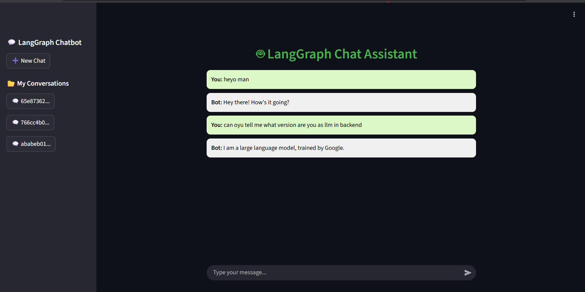

# 🤖 LangGraph Chatbot

[](https://www.python.org/)
[](https://streamlit.io/)
[](LICENSE)

A **stateful chatbot** built using **Google Gemini LLM** with **LangGraph** for conversation state management.  
It uses a **Streamlit frontend** for interactive chat and a **backend** for handling AI responses, conversation state, and SQLite-based persistence.

---

## 🌟 Features

- **Stateful conversations**: Supports multiple chat threads and resumes previous sessions.  
- **Google Gemini LLM integration** via `langchain-google-genai`.  
- **SQLite database** stores chat threads persistently.  
- **Streamlit frontend**: Modern chat interface with styled message bubbles.  
- **Secure API management** using `.env` for environment variables.  
- Modular backend and frontend for easy extension.

---

## 🗂 Project Structure

LangGraph_Chatbot/
├── backend/
│ └── langgraph_database_backend.py
├── frontend/
│ └── chatbot_ui.py
├── assets/
│ └── chatbot_ui_screenshot.png
├── .env
├── .gitignore
├── requirements.txt
└── README.md

---

## 🖼 User Interface

Here’s how the LangGraph Chatbot looks in action:

<p align="center">
  
</p>

> Full-width chat bubbles for user and bot messages, with a sidebar to manage multiple chat threads.

---

## ⚙️ Setup Instructions

1. **Clone the repository**

```bash
git clone https://github.com/yourusername/LangGraph_Chatbot.git
cd LangGraph_Chatbot

2. **Create and activate a virtual environment**
python -m venv venv
source venv/bin/activate      # Linux/Mac
venv\Scripts\activate         # Windows

3. **Install dependencies**
pip install -r requirements.txt

4. **Add your Google API key**
Create a .env file in the project root:
GOOGLE_API_KEY=your_google_api_key_here

5. **Run the frontend UI**
streamlit run frontend/chatbot_ui.py
Open the URL shown in the terminal (usually http://localhost:8501).
